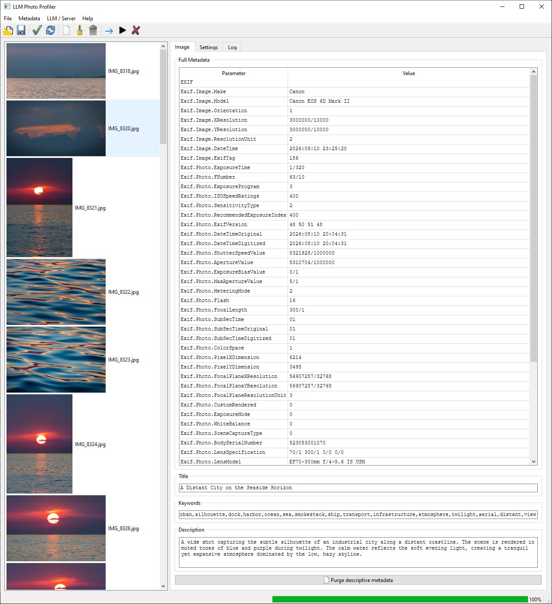

# LLM Photo Profiler

A quick and dirty (less than 1000 lines of Python initially) PyQt6-based tool that allows usage of the locally running or remote LLM (via OpenAI-compatible API) to automatically profile the photographs. The AI profiler then fills the photographs' metadata: title, keywords and description, to make them searchable.

-----

## Features

- Configurable local runs of the LLM using [`llama.cpp`](https://github.com/ggml-org/llama.cpp).
- Built-in simplest photo list viewer.
- Configurable prompts.
- Auto logging for generation and local LLM runs.
- Metadata viewer.
- Manual editions for the descriptive fields (title, keywords, description).
- Metadata removal on different levels: descriptive group removal, truncation to the basic IPTC/EXIF metadata, total purge.
- Manual processing of the photographs, taking the existing title into attention.
- Automatic processing of all the photographs in the given directory.

## Dependencies

- [`PyQt6`](https://pypi.org/project/PyQt6/)
- [`pyexiv2`](https://github.com/LeoHsiao1/pyexiv2)

-----

Written by hands, without an AI. All contributions are encouraged!
